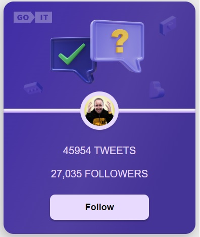
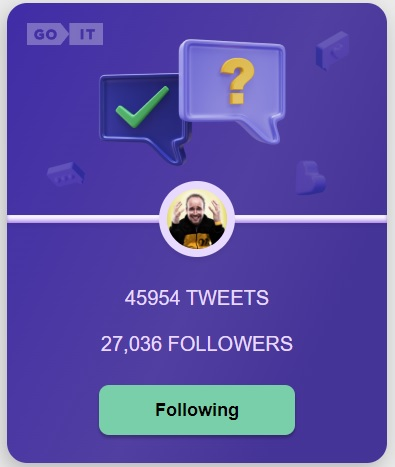

<h1>Twitter Card Interactivity</h1>

This project implemented tweet cards with interactivity, allowing the user to follow and unfollow other users. The app uses React Router for routing and a custom backend built with the mockapi.io UI service.
The project also contains a pagination of pages. there are 3 user cards on each page

<h2>Screenshots cards</h2>

Following is false

Following is true

  

<h2>Technical Task</h2>

The goal of this project is to create tweet cards with interactive functionality. The card has two states: Follow and Follow.
When the user clicks the Subscribe button, the text changes to Subscribe, the button color changes, and the number of subscribers increases by 1. 
When the page is updated, the button stays in the "Subscribed" state with the appropriate color, and the number of subscribers is not reset to its original value. 
Click the button resets the button once again, changing the text and color back to "Subscribe" and decrementing the number of subscribers by 1.
The user's actions must be recorded, and the final result must be preserved even after a page refresh.

<h2>User Object</h2>

The application uses a personal backend created with mockapi.io UI service. The user object includes the following fields:
id: Unique identifier for the user.
user: Username of the user.
tweets: Array of tweets associated with the user.
followers: Number of followers for the user.
avatar: URL of the user's avatar image. 

